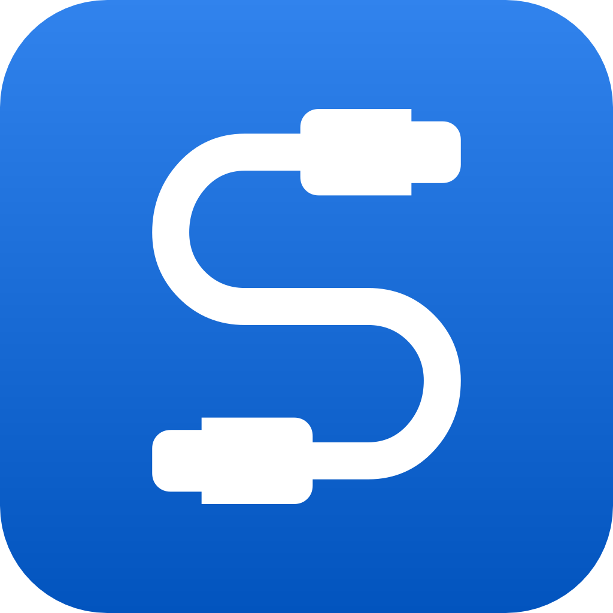

<p align="center">
  <a href="#">
    
  </a>
</p>

<p align="center">
  
  
  
  
  
  
  
</p>

# SignalDB

SignalDB is a client-side database that provides a simple MongoDB-like interface to the data with first-class typescript support to achieve an optimistic UI.
Data persistence can be achieved by using storage providers that store the data through a JSON interface to places such as localStorage.

## Installation

````
  $ npm install signaldb
````

## Usage

```js
import { Collection } from 'signaldb'

const posts = new Collection()
const postId = posts.insert({ title: 'Foo', text: 'Lorem ipsum …' })
const cursor = collection.find({})
console.log(cursor.fetch()) // returns an array with all documents in the collection
```

Please also take a look at the [documentation](https://maxnowack.github.io/signaldb)

## Architecture

### Reactivity

SignalDB uses the primitives of signals to provide reactivity. We want to keep dependencies small and don't lock into a specific framework. SignalDB works with the signal library of your choice. We've written adapters for all the popular ones. If you think an adapter is missing, you can file an issue or submit a pull request and add it yourself.

### Collections & Queries

SignalDB keeps all data in memory to provide blazing fast query performance. This also allows it to have a synchronous api. This means you don't have to worry about asynchronous operations when working with your data.

### Data Persistance

SignalDB provides an interface where data can be persisted. It works by loading and saving the documents inside to an external system. Reads and writes are triggered by events in both directions.
The simplest and default persistence interface is `localStorage`, where data is loaded and saved from `window.localStorage`. However, since all data is in memory, data persistence is completely optional and is only needed if you want to keep your data across page loads.

### Replication

It's planned to implement a data replication engine based on the paradigms used by then [replication protocol of RxDB](https://rxdb.info/replication.html) ([more info](https://github.com/pubkey/rxdb/issues/3883)).
In the first version, we provide data replication by implementing only a persistence interface for RxDB, and the replication is handled inside RxDB.

## License
Licensed under MIT license. Copyright (c) 2023 Max Nowack

## Contributions
Contributions are welcome. Please open issues and/or file Pull Requests.

## Maintainers
- Max Nowack ([maxnowack](https://github.com/maxnowack))
