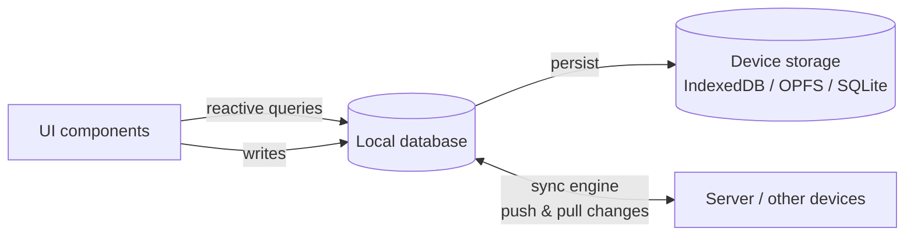

# Local-First Software

## What Is Local-First Software?

**Local-first software keeps the primary copy of your data on your own device. The app reads and writes locally, and a sync engine exchanges changes with servers and other devices in the background.** The cloud is still useful for backup, multi-device access and collaboration, but the app no longer depends on it to work.

This is the opposite of a typical web app, where the server holds the data and the browser only shows a view of it. In a local-first app, every interaction is answered from local data, so the app is fast, works offline, and keeps working even if the server is slow or gone.

The term was coined in the 2019 essay [*Local-first software: You own your data, in spite of the cloud*](https://www.inkandswitch.com/essay/local-first/) by Martin Kleppmann, Adam Wiggins, Peter van Hardenberg and Mark McGranaghan at Ink & Switch. Since then, local-first has grown into a movement with its own [community, conferences and tool directory](https://lofi.so/).

## The Seven Ideals of Local-First Software

The Ink & Switch essay defines seven ideals that local-first software should aim for:

1. **No spinners: your work at your fingertips.** Reads and writes are local, so the app responds instantly.
2. **Your work is not trapped on one device.** Data syncs across all devices of a user.
3. **The network is optional.** Everything works offline; sync happens when a connection is available.
4. **Seamless collaboration with your colleagues.** Multiple people can work on the same data, ideally in real time.
5. **The Long Now.** Data stays accessible for years, even if the vendor's servers disappear.
6. **Security and privacy by default.** Data on servers can be encrypted end to end.
7. **You retain ultimate ownership and control.** Users can copy, modify and delete their data without asking a service for permission.

Few apps fulfil all seven ideals. In practice, "local-first" is used for a spectrum of architectures. Most production apps start with the first three (speed, multi-device and offline) and keep a server as the source of truth.

## How Local-First Apps Work

A local-first app has three building blocks:



1. **A local database** holds the data the user works with. In the browser it is persisted in [IndexedDB, OPFS or localStorage](/data-persistence/), on mobile usually in SQLite.
2. **Reactive queries** connect the database to the UI. When data changes, whether by a local write or by sync, every affected view updates automatically.
3. **A sync engine** records local changes, pushes them to the server, pulls remote changes and resolves conflicts.

Because the UI only ever talks to the local database, [optimistic UI](/optimistic-ui/) and [offline support](/offline-first/) come for free: a write is visible immediately and is synced later.

## Approaches to Local-First Sync

The sync engine is the hardest part of a local-first app. There are three common approaches:

| Approach | How it works | Typical tools | Good for |
|---|---|---|---|
| **Server-authoritative sync** | Clients queue local changes and replay them on top of the latest server state; the server decides | SignalDB, RxDB, WatermelonDB, Replicache/Zero | Apps with an existing backend, business rules and permissions on the server |
| **Database replication** | A client database replicates a subset of a server database (e.g. Postgres or CouchDB) | PouchDB with CouchDB, ElectricSQL, PowerSync | Apps whose backend is built around that database |
| **CRDTs** | Data types that merge concurrent changes automatically, without a central authority | Automerge, Yjs, TinyBase (MergeableStore) | Collaborative editing, peer-to-peer sync |

Server-authoritative sync is the most common choice for business applications: it keeps validation, permissions and conflict rules on the server and works with ordinary REST or GraphQL APIs. CRDTs come closest to the "ownership" and "Long Now" ideals, but make server-side validation and schema changes harder.

## Local-First vs. Offline-First vs. Cloud Apps

| | Cloud app (thin client) | Offline-first app | Local-first app |
|---|---|---|---|
| Primary copy of the data | Server | Server, cached on the client | Client device |
| Works offline | No | Yes | Yes |
| Speed of interactions | Network round trip | Instant for cached data | Instant |
| Multi-device and collaboration | Yes (via server) | Yes (via server) | Yes (via sync) |
| Data ownership | Vendor | Vendor | User (to varying degrees) |

[Offline-first](/offline-first/) describes the *capability* to work without a network. Local-first is the broader *philosophy* that the local copy is the primary one. Technically, both rely on the same foundation: a local database with sync.

## Benefits and Trade-offs

**Benefits**
- **Instant UI**: no loading spinners for reads or writes.
- **Offline support**: the app works on trains, planes and bad Wi-Fi.
- **Less backend load**: queries run on the client; the server mainly stores and distributes changes.
- **Simpler frontend state**: the local database replaces ad-hoc caches and global stores.

**Trade-offs**
- **Data has to fit on the device.** You usually sync a user-specific subset, not the whole database.
- **Sync and conflicts are real work.** You need a clear conflict strategy and must handle rejected changes.
- **Permissions move to the sync layer.** The server must check every pushed change, because clients can no longer be trusted to only call allowed endpoints.
- **Schema changes are harder.** Old clients with offline data must keep working after a migration.
- **Initial load**: the first sync of a large dataset can take a while.

## Local-First Tools for JavaScript

The JavaScript ecosystem offers tools for every layer:

- **Local databases with sync**: SignalDB, RxDB, Dexie.js, PouchDB, WatermelonDB, TinyBase, TanStack DB. See the [JavaScript database comparison](/comparison/) for a detailed feature matrix.
- **Sync engines for existing databases**: ElectricSQL and PowerSync (Postgres and other databases), Replicache/Zero.
- **CRDT libraries**: Automerge, Yjs.
- **Hosted local-first platforms**: InstantDB, Jazz, Triplit and others.

The [local-first directory on lofi.so](https://lofi.so/directory) lists many more projects.

## Building a Local-First App with SignalDB

[SignalDB](/getting-started/) is a reactive local-first database for JavaScript that uses server-authoritative sync with any backend. A local-first setup takes three steps.

**1. Create a persisted, reactive collection** using the signal library of your framework (here Solid; adapters exist for Angular, Vue, Preact, Svelte, MobX and [more](/reactivity/#reactivity-libraries)):

```js
import { Collection, DefaultDataAdapter } from '@signaldb/core'
import createIndexedDBAdapter from '@signaldb/indexeddb'
import solidReactivityAdapter from '@signaldb/solid'

export const dataAdapter = new DefaultDataAdapter({
  storage: createIndexedDBAdapter({
    databaseName: 'my-app',
    version: 1,
    schema: {
      'notes': ['archived'],
      // stores the SyncManager keeps its change queue in
      'app-changes': ['collectionName'],
      'app-snapshots': ['collectionName'],
      'app-sync-operations': ['collectionName', 'status'],
    },
  }),
})

export const notes = new Collection('notes', dataAdapter, {
  reactivity: solidReactivityAdapter,
})
```

**2. Query and write locally.** Queries inside effects re-run when data changes; writes are visible immediately:

```js
import { createEffect } from 'solid-js'

createEffect(() => {
  const myNotes = notes.find({ archived: false }, { sort: { updatedAt: -1 } }).fetch()
  render(myNotes)
})

await notes.insert({ text: 'Local-first!', archived: false, updatedAt: Date.now() })
```

**3. Add sync with your backend.** The [`SyncManager`](/sync/) persists the queue of local changes, pushes them to your API, pulls remote changes and resolves conflicts by replaying local changes on the latest server data:

```js
import { SyncManager } from '@signaldb/sync'

const syncManager = new SyncManager({
  id: 'app',
  dataAdapter, // the same data adapter the collections use
  pull: async ({ apiPath }) => ({ items: await fetch(apiPath).then(res => res.json()) }),
  push: async ({ apiPath }, { changes }) => {
    await fetch(apiPath, { method: 'POST', body: JSON.stringify(changes) })
  },
  registerRemoteChange: (options, onChange) => {
    // e.g. call onChange() when your WebSocket or SSE connection reports new data
  },
})

syncManager.addCollection(notes, { name: 'notes', apiPath: '/api/notes' })
```

This covers the first four local-first ideals (instant UI, multi-device, offline, collaboration through the server) while your backend stays the source of truth. There are complete examples for a [plain HTTP API](https://signaldb.js.org/examples/replication-http/), [Supabase](https://signaldb.js.org/examples/supabase/), [Firebase](https://signaldb.js.org/examples/firebase/) and [Appwrite](https://signaldb.js.org/examples/appwrite/).

## Frequently Asked Questions

### What does local-first mean?

Local-first means that an application stores the primary copy of its data on the user's device, reads and writes it locally, and synchronizes with servers and other devices in the background.

### What is a local-first database?

A database that runs inside the client application (browser, desktop or mobile app), persists data on the device and has a sync mechanism to exchange changes with a server or other clients.

### Is local-first the same as offline-first?

Not exactly. Offline-first means the app keeps working without a network. Local-first additionally treats the local copy as the primary one and aims for user ownership of data. Both are built on a local database with sync.

### Do local-first apps still need a server?

Usually yes: for sync between devices, backups, collaboration, authentication and permissions. The difference is that the app does not need the server to *work*.

### Do I need CRDTs to build a local-first app?

No. CRDTs are one way to merge concurrent changes, well suited for collaborative editing. Many local-first apps use server-authoritative sync instead, where local changes are replayed on the latest server state. SignalDB uses this approach.

## Conclusion

Local-first software moves the primary copy of data to the user's device and treats the network as optional. The result is faster, more resilient apps, at the cost of handling sync, conflicts and permissions carefully. For JavaScript developers, the main decision is the local database and its sync model. [Compare the options](/comparison/), or [get started with SignalDB](/getting-started/) to add local-first data to your existing app and backend.
