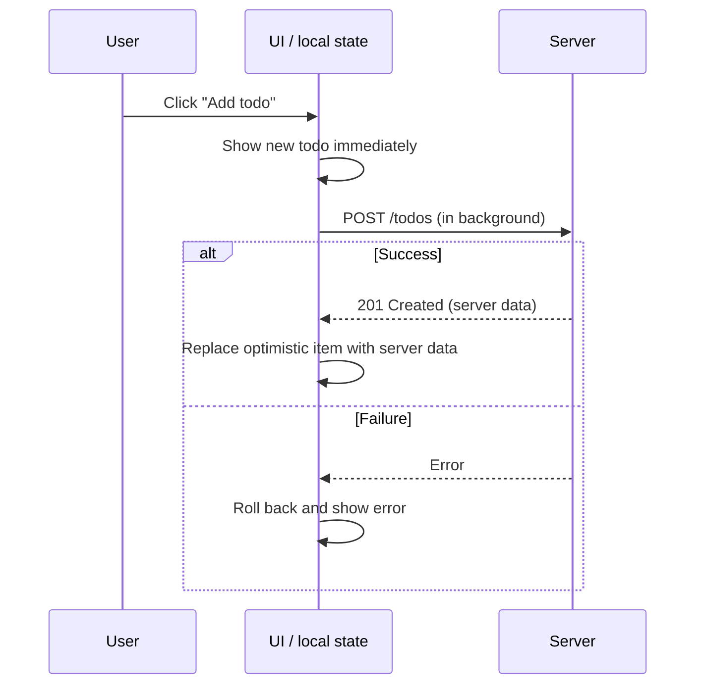

---
head:
- - link
  - rel: canonical
    href: https://signaldb.js.org/optimistic-ui/
- - meta
  - name: og:type
    content: article
- - meta
  - name: og:url
    content: https://signaldb.js.org/optimistic-ui/
- - meta
  - name: og:title
    content: 'Optimistic UI: What It Is and How to Implement It'
- - meta
  - name: og:description
    content: What optimistic UI is, how optimistic updates and rollbacks work, when to use them, and how to implement them with React's useOptimistic, React Query or a local database.
- - meta
  - name: description
    content: What optimistic UI is, how optimistic updates and rollbacks work, when to use them, and how to implement them with React's useOptimistic, React Query or a local database.
- - meta
  - name: keywords
    content: optimistic UI, optimistic updates, what is optimistic UI, optimistic UI updates, useOptimistic, React Query optimistic updates, rollback, local database, local-first, offline-first, SignalDB
---
# Optimistic UI: What It Is and How to Implement It

## Introduction to Optimistic UI

**Optimistic UI is a pattern where the interface shows the result of a user action immediately, before the server has confirmed it, and only corrects itself if the request fails.** Instead of showing a spinner while waiting for the server, the app assumes success. Most requests do succeed.

A familiar example is the "like" button in social apps: the heart turns red the moment you tap it. The request to the server happens in the background. If it fails, the heart quietly turns grey again and an error is shown.

Optimistic updates make apps feel instant, because the perceived latency of an action drops from a network round trip (often hundreds of milliseconds) to a single render.

## How Optimistic Updates Work

Every optimistic update follows the same four steps:

1. **Apply locally**: update the UI state as if the action had succeeded, and remember what it looked like before.
2. **Send the request**: send the change to the server in the background.
3. **Reconcile**: when the server responds, replace the optimistic data with the server's version, for example to get the real ID or a server-side timestamp.
4. **Roll back on failure**: if the request fails, restore the previous state and tell the user.



The hard parts are steps 3 and 4: keeping track of which changes are still pending, applying server responses that arrive out of order, and rolling back correctly when several optimistic changes touch the same data.

## When to Use Optimistic UI

Optimistic UI works best when:

- the action **almost always succeeds** (likes, toggles, reordering, adding items to a list, editing text);
- a failure is **cheap to undo** and easy to explain to the user;
- the user benefits from **continuing immediately**, for example when adding several items in a row.

Avoid it, or show explicit pending states instead, when:

- the outcome **depends on the server** (payments, bookings, stock availability, permission checks);
- the action is **irreversible** or has side effects outside the app (sending an email, publishing);
- a rollback would **destroy user input** that is hard to recreate.

## Optimistic Updates in React: useOptimistic and React Query

In React, there are two common ways to implement optimistic updates for a single mutation.

**React's `useOptimistic` hook** (React 19) shows a temporary state while an async action is running:

```jsx
import { useOptimistic } from 'react'

function TodoList({ todos, addTodo }) {
  const [optimisticTodos, addOptimisticTodo] = useOptimistic(
    todos,
    (state, newTodo) => [...state, { ...newTodo, pending: true }],
  )

  async function formAction(formData) {
    const todo = { title: formData.get('title') }
    addOptimisticTodo(todo)
    await addTodo(todo) // when this settles, optimisticTodos falls back to todos
  }

  return (
    <form action={formAction}>
      {optimisticTodos.map(todo => <p key={todo.title}>{todo.title}</p>)}
      <input name="title" />
    </form>
  )
}
```

**TanStack Query (React Query)** uses the `onMutate`, `onError` and `onSettled` callbacks of a mutation: write the optimistic value into the query cache in `onMutate`, restore the snapshot in `onError`, and refetch in `onSettled`.

Both approaches work well for individual actions, but they have the same limits:

- Optimistic state lives **per mutation or per component**, and you write the rollback logic yourself.
- Pending changes are **lost on reload**, and nothing works **offline**.
- Every view that shows the same data has to be updated separately.

## Understanding Local Databases

A local database stores application data on the user's device, for example in the browser's IndexedDB or OPFS, or in SQLite on mobile, and answers queries without a network round trip. Many local databases can also **replicate** data from a server: they keep a local copy in sync with the backend in both directions.

This changes how optimistic UI works.

## The Connection Between Local Databases and Optimistic UI

With a local database, the UI does not render server responses. It renders the result of **local queries**. Every write goes to the local database first, and the database syncs with the server in the background.

That makes every write optimistic by default:

- **Apply locally**: writing to the local database *is* the optimistic update. Every view that queries the affected data updates, not just the component that triggered the action.
- **Send the request**: the sync layer pushes the change and keeps it queued (and persisted) until the server accepts it, even across reloads and offline periods.
- **Reconcile and roll back**: after a push, the next pull brings the server's version of the data into the local database. If the server rejected a change, the server state replaces the local change, which acts as a rollback.

This is the core idea of [offline-first](/offline-first/) and local-first apps: the UI never waits for the network.

## Optimistic UI with SignalDB

[SignalDB](/getting-started/) is a reactive local database that implements this pattern. Queries run inside your framework's effects are reactive, so a local write updates the UI immediately:

```js
import { Collection, DefaultDataAdapter } from '@signaldb/core'
import { SyncManager } from '@signaldb/sync'
import createIndexedDBAdapter from '@signaldb/indexeddb'
import solidReactivityAdapter from '@signaldb/solid'

const dataAdapter = new DefaultDataAdapter({
  storage: createIndexedDBAdapter({
    databaseName: 'my-app',
    version: 1,
    schema: {
      'todos': [],
      // stores the SyncManager keeps its change queue in
      'app-changes': ['collectionName'],
      'app-snapshots': ['collectionName'],
      'app-sync-operations': ['collectionName', 'status'],
    },
  }),
})

const todos = new Collection('todos', dataAdapter, {
  reactivity: solidReactivityAdapter,
})

const syncManager = new SyncManager({
  id: 'app',
  dataAdapter,
  pull: async ({ apiPath }) => ({ items: await fetch(apiPath).then(res => res.json()) }),
  push: async ({ apiPath }, { changes }) => {
    const response = await fetch(apiPath, { method: 'POST', body: JSON.stringify(changes) })
    if (response.status >= 400 && response.status < 500) {
      // validation error: don't retry; the next pull restores the server state
      showError(await response.text())
      return
    }
    if (!response.ok) throw new Error('Push failed') // network/server error: retried on next sync
  },
})
syncManager.addCollection(todos, { name: 'todos', apiPath: '/api/todos' })

// In your UI: the new todo appears instantly, before the server has answered
await todos.insert({ title: 'Write docs', completed: false })
```

- **Instant updates everywhere**: every reactive query that matches the new todo re-runs, in every component.
- **Retries and offline**: if the push fails because of a network or server error, the change stays queued and is pushed again on the next sync, also after a reload.
- **Rollback for rejected changes**: validation errors are handled in `push`; the following pull replaces the local data with the server's version.
- **Conflicts**: local changes are replayed on top of the latest server data, and the most recent change wins (see [Sync Flow & Conflict Resolution](/sync/#sync-flow-conflict-resolution)).

SignalDB works with the signals of your framework. See the guides for [React](/guides/react/), [Vue](/guides/vue/), [Angular](/guides/angular/), [Svelte](/guides/svelte/) and [Solid](/guides/solid-js/), or the examples for [Supabase](/supabase/) and [Firebase](/firebase/).

## Improving User Experience with Optimistic UI

A few UX details make optimistic interfaces trustworthy:

- **Mark pending items subtly**, for example with reduced opacity or a small sync icon, so users know a change has not reached the server yet.
- **Explain rollbacks**: when a change is reverted, say why ("Couldn't save: title is required") and, if possible, keep the user's input so it can be fixed.
- **Show global sync state**: a small "Saving…/All changes saved" indicator is enough. With SignalDB, `syncManager.isSyncing()` can drive it directly. It is reactive when you pass a reactivity adapter to the `SyncManager`.
- **Don't fake irreversible actions**: for payments or sends, show a real pending state instead.

## Real-time UI Updates with Local Databases

Optimistic UI covers *your own* changes. Changes from other users or devices arrive through sync: with live updates (WebSockets or server-sent events), the server notifies the client, the client pulls the new data into the local database, and every reactive query updates. Local writes and remote changes go through the same path, so the UI code doesn't care where a change came from. See [Real-Time Web Apps](/real-time/) and [Live Updates](/live-updates/) for the underlying techniques.

## Frequently Asked Questions

### What is optimistic UI?

A UI pattern that shows the result of an action immediately, assuming it will succeed, and rolls it back if the server reports an error.

### What is the difference between optimistic and pessimistic UI?

A pessimistic UI waits for the server's confirmation before showing the result, usually with a spinner. An optimistic UI shows the result first and confirms or corrects it afterwards.

### How do you roll back an optimistic update?

Keep the previous state (or the list of pending changes) until the server confirms the change. If the request fails, restore that state. With a local database and sync, the next pull from the server restores the authoritative state automatically.

### Is optimistic UI the same as offline-first?

No, but they are closely related. Optimistic UI is about not waiting for the server for a single action. [Offline-first](/offline-first/) applies the same idea to the whole app: all reads and writes are local, and sync runs in the background.

## Conclusion

Optimistic UI makes apps feel instant by showing the result of an action before the server confirms it. For single actions, React's `useOptimistic` or React Query's mutation callbacks are enough. When many views share the same data, or the app should keep working offline, a reactive local database such as [SignalDB](/getting-started/) makes every write optimistic by default and handles retries, persistence and reconciliation for you.
