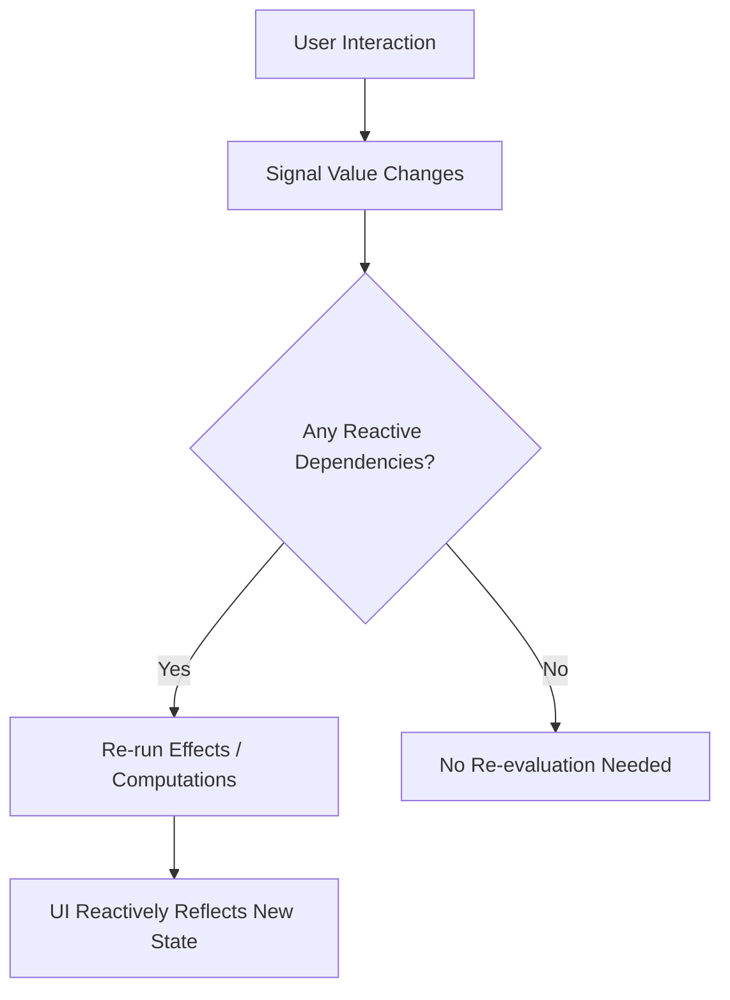

---
head:
- - link
  - rel: canonical
    href: https://signaldb.js.org/signals/
- - meta
  - name: og:type
    content: article
- - meta
  - name: og:url
    content: https://signaldb.js.org/signals/
- - meta
  - name: og:title
    content: 'JavaScript Signals Explained: How They Work, with Examples'
- - meta
  - name: og:description
    content: What JavaScript signals are, how dependency tracking works, signals vs. observables, signal APIs in Solid, Angular, Vue, Preact and Svelte, and the TC39 Signals proposal.
- - meta
  - name: description
    content: What JavaScript signals are, how dependency tracking works, signals vs. observables, signal APIs in Solid, Angular, Vue, Preact and Svelte, and the TC39 Signals proposal.
- - meta
  - name: keywords
    content: JavaScript signals, js signals, signals javascript, TC39 signals proposal, signals vs observables, Preact signals, Angular signals, Solid signals, Vue signals, Svelte runes, fine-grained reactivity, SignalDB
---
# JavaScript Signals Explained

## Introduction

**JavaScript signals are reactive values: when a signal changes, everything that reads it (computed values, effects, UI) updates automatically, and nothing else does.** They are the reactivity primitive behind Solid, Angular, Preact, Vue's refs and Svelte's runes, and a [TC39 proposal](#the-tc39-signals-proposal) aims to make them part of the language.

```js
import { signal, computed, effect } from '@preact/signals-core'

const count = signal(0)
const double = computed(() => count.value * 2)

effect(() => {
  console.log(`count: ${count.value}, double: ${double.value}`)
}) // logs "count: 0, double: 0"

count.value = 1 // logs "count: 1, double: 2"
```

This article explains how signals work, when to use them, how they differ from observables, what they look like in popular frameworks, and how you can use signals for more than UI state, for example to [query a local database reactively](#signals-beyond-ui-state-a-reactive-database).

::: info What are JavaScript signals?
JavaScript signals are reactive primitives that hold a value and automatically notify everything that depends on it when that value changes. This enables fine-grained reactivity without manual subscriptions.
:::

## Understanding Signals in JavaScript

Almost every signal implementation is built from three primitives:

- **Signal** (also called *state*, *ref* or *atom*): holds a value that can be read and written.
- **Computed** (also called *memo* or *derived*): a value derived from other signals. It is cached and only recalculated when one of its dependencies changes.
- **Effect**: a function that runs side effects such as rendering, logging or network calls, and re-runs whenever a signal it read has changed.

A signal is usually used together with an `effect` function. The connection between signals and effects is what makes reactivity automatic: you never subscribe to a signal by hand. Reading it inside an effect is enough.

## When to Use JavaScript Signals

JavaScript signals are particularly useful in scenarios where fine-grained reactivity and real-time updates are critical. Consider using signals when:

- You're building interactive UIs that respond to user input in real time
- Your application relies heavily on dynamic or frequently changing data
- You want to minimize unnecessary DOM updates and improve rendering performance
- You need to synchronize state between components or even across clients
- You want to adopt a declarative and reactive programming style with fewer dependencies

Signals are less useful for one-off values that never change, or for modelling sequences of events over time (clicks, WebSocket messages, debounced input). Those are better expressed as [observables or event streams](#signals-vs-observables).

> **JavaScript signals** are reactive primitives that represent values over time and automatically notify subscribers of changes, enabling fine-grained reactivity in applications.

### Signals and Reactive Programming

[Reactive programming](https://en.wikipedia.org/wiki/Reactive_programming) is a declarative programming paradigm concerned with data streams and the propagation of change. In JavaScript, this involves:
- **Reactive sources**: values or streams that can be observed.
- **Dependents**: computations or components that react to changes of those sources.
- **Automatic updates**: when a source changes, its dependents update without explicit commands to re-render or re-fetch.

Signals are the "current value" flavour of reactive programming: a signal always has a value, and dependents are tracked automatically.

### Role of the Effect Function in Signals

The `effect` function is the bridge between reactive data and the outside world:
- **Automatic updates**: an effect re-runs whenever a signal it read during its last run changes.
- **Dependency tracking**: it records which signals were read while it ran, so only relevant changes trigger a re-run.
- **Resource management**: most implementations let an effect return or register a cleanup function that runs before the next execution and when the effect is disposed, which is the place to remove event listeners or close subscriptions.

### Benefits of Using Signals in JavaScript

- **Fine-grained updates**: only the computations and DOM nodes that depend on a changed value are updated.
- **No manual subscriptions**: dependencies are tracked automatically, so there is nothing to forget to unsubscribe.
- **Decoupled components**: state can live outside components and be shared without prop drilling or global stores.
- **Readable data flow**: derived values are declared once with `computed` instead of being kept in sync by hand.

## Signals vs. Observables

Signals and observables (for example [RxJS](https://rxjs.dev/)) are both reactive, but they model different things:

| | Signals | Observables (RxJS) |
|---|---|---|
| Represents | a value that changes over time | a stream of events over time |
| Current value | always available (`count.value`, `count()`) | not by default (only e.g. `BehaviorSubject`) |
| Dependency tracking | automatic, by reading the signal | explicit, via `subscribe()` and operators |
| Unsubscribing | handled by the effect's lifecycle | manual, or via operators like `takeUntil` |
| Timing and async | synchronous and glitch-free by design | built for async: `debounceTime`, `switchMap`, retries |
| Typical use | UI state, derived data, query results | user input streams, WebSockets, request orchestration |

**Rule of thumb:** use signals for *state* that the UI reads, and observables for *events* that need time-based operators. Many apps use both. Angular, for example, ships `toSignal()` and `toObservable()` in `@angular/core/rxjs-interop` to convert between them.

## Signals in Popular Frameworks

Every major framework now has a signal-like primitive, under different names:

| Framework / library | Create | Derive | Effect | SignalDB adapter |
|---|---|---|---|---|
| [Solid](https://docs.solidjs.com/concepts/signals) | `createSignal(0)` | `createMemo(() => …)` | `createEffect(() => …)` | [`@signaldb/solid`](/reference/solid/) |
| [Angular](https://angular.dev/guide/signals) | `signal(0)` | `computed(() => …)` | `effect(() => …)` | [`@signaldb/angular`](/reference/angular/) |
| [Vue](https://vuejs.org/guide/essentials/reactivity-fundamentals.html) | `ref(0)` | `computed(() => …)` | `watchEffect(() => …)` | [`@signaldb/vue`](/reference/vue/) |
| [Preact Signals](https://preactjs.com/guide/v10/signals/) | `signal(0)` | `computed(() => …)` | `effect(() => …)` | [`@signaldb/preact`](/reference/preact/) |
| [Svelte 5 runes](https://svelte.dev/docs/svelte/what-are-runes) | `$state(0)` | `$derived(…)` | `$effect(() => …)` | [`@signaldb/svelte`](/reference/svelte/) |
| [MobX](https://mobx.js.org/) | `observable(…)` | `computed(() => …)` | `autorun(() => …)` | [`@signaldb/mobx`](/reference/mobx/) |
| TC39 proposal | `new Signal.State(0)` | `new Signal.Computed(() => …)` | none built in ([see below](#the-tc39-signals-proposal)) | – |

**React** has no built-in signals: `useState` re-renders the whole component. You can add signals with a library such as `@preact/signals-react`. SignalDB's [React integration](/guides/react/) wraps any signal library's `effect` in a `useReactivity` hook.

A full list of supported libraries is on the [Reactivity](/reactivity/#reactivity-libraries) page.

## Origins of Signals in Programming

The idea of a value that notifies its dependents is much older than today's frameworks.

### Early Beginnings in Software Engineering

The word "signal" was used early on in operating systems, where signals handle interrupts and inter-process communication: asynchronous notifications that something has happened. Today's JavaScript signals share the name and the idea of notification, but model *values* rather than one-off events.

### Influence of Functional Reactive Programming (FRP)

Functional Reactive Programming treats data as values that change over time and lets programs declare how other values depend on them. Signals in modern JavaScript are a pragmatic, imperative descendant of this idea: a signal is the current value of such a time-varying quantity.

### Adaptation to Web Development

In the browser, observable values appeared early in UI libraries. [Knockout](https://knockoutjs.com/) shipped observables and computed values with automatic dependency tracking in 2010, and Meteor's Tracker and MobX followed similar models. As web applications became more interactive, this approach was refined into today's lightweight signal primitives.

### The SolidJS Revolution and the Rise of Signals

[SolidJS](https://docs.solidjs.com/concepts/intro-to-reactivity) made signals the centre of a UI framework: components run once, and only the DOM nodes that read a signal are updated when it changes. Its performance and simplicity triggered a wave of interest in signals across the ecosystem, documented in Ryan Carniato's article [*The Evolution of Signals in JavaScript*](https://dev.to/thisdotmedia/the-evolution-of-signals-in-javascript-ryan-carniato-5ejn).

### Influence on Other Frameworks

Since then, Preact (Preact Signals), Angular (Angular Signals), Svelte (runes in Svelte 5) and Qwik have adopted signals as their reactivity model, and Vue's refs follow the same principle. The convergence of these frameworks led directly to the TC39 proposal.

## The TC39 Signals Proposal

The [TC39 Signals proposal](https://github.com/tc39/proposal-signals) aims to add a standard `Signal` primitive to JavaScript itself. It is at **Stage 1** (as of October 2026), which means TC39 is exploring the problem space; the API can still change significantly. It was started by Rob Eisenberg and Daniel Ehrenberg, with design input from the maintainers of Angular, Ember, MobX, Preact, Qwik, RxJS, Solid, Svelte, Vue and others.

The proposed API has two core classes:

```js
const counter = new Signal.State(0)
const isEven = new Signal.Computed(() => (counter.get() & 1) === 0)
const parity = new Signal.Computed(() => (isEven.get() ? 'even' : 'odd'))

counter.set(1)
parity.get() // 'odd'
```

Key points:

- **It is meant for frameworks, not primarily for app code.** The goal is a shared, interoperable signal graph that frameworks can build on, so that signals from one library can be used in another.
- **There is no built-in `effect`.** Effect scheduling is tied to each framework's rendering cycle, so the proposal only provides a low-level `Signal.subtle.Watcher` that frameworks use to implement their own effects.
- **You can try it today** with the [`signal-polyfill`](https://github.com/proposal-signals/signal-polyfill) package.

If the proposal advances, framework-specific signals would become thin wrappers around a native primitive, and libraries such as SignalDB could support all of them through a single integration.

## How Signals Work - Technical Perspective

Signals operate as reactive primitives that automatically propagate changes through an application, ensuring that all dependent states or components are updated efficiently and consistently.

### Signal Creation and Propagation

At its core, a signal holds a value and a list of dependents. When the value is written, the signal marks its dependents as stale and schedules them to re-run.



For example, when a user types into a form field, the signal holding the field's value changes, and only the parts of the UI that display or validate that value update.

### Dependency Tracking

When a signal is read inside a reactive context, such as an effect or a computed value, the runtime records it as a dependency of that context. This is usually implemented with a global "currently running computation" pointer: every signal read checks the pointer and adds the running computation to its subscribers.

This mechanism is efficient because it only re-evaluates the parts of the application that are actually affected by a change, instead of re-rendering entire component trees.

### Efficient State Management

Computed values are lazy and cached: they only recalculate when read *and* when a dependency has changed. Most implementations are also *glitch-free*, which means a computed value is never observed in an inconsistent intermediate state when several of its dependencies change at once.

### Integration with the UI

In signal-based frameworks, the renderer itself is an effect. When a signal changes, only the DOM nodes or components that read it are updated. This removes most of the glue code that is otherwise needed to keep UI and state in sync.

## Signals Beyond UI State: a Reactive Database

Signals work well for individual values. Application data, however, is usually a *collection of records* that you filter, sort, persist and sync with a server. Keeping that in hand-written signals quickly turns into a home-made database.

[SignalDB](/) is a reactive local database built on this idea: queries run against local collections with a MongoDB-like API, and any query executed inside an effect becomes reactive through the signal library you already use.

```js
import { signal, effect } from '@preact/signals-core'
import { Collection, DefaultDataAdapter } from '@signaldb/core'
import preactReactivityAdapter from '@signaldb/preact'
import createIndexedDBAdapter from '@signaldb/indexeddb'

const dataAdapter = new DefaultDataAdapter({
  storage: createIndexedDBAdapter({
    databaseName: 'my-app',
    version: 1,
    schema: { todos: ['completed'] },
  }),
})

const todos = new Collection('todos', dataAdapter, {
  reactivity: preactReactivityAdapter,
})

const showCompleted = signal(false)

effect(() => {
  const cursor = todos.find(showCompleted.value ? {} : { completed: false })
  console.log(cursor.fetch()) // re-runs when matching todos or the filter change
  return () => cursor.cleanup()
})

await todos.insert({ title: 'Write docs', completed: false }) // effect re-runs
showCompleted.value = true // effect re-runs
```

What this gives you on top of plain signals:

- **Works with your signal library**: adapters for Solid, Angular, Vue, Preact, Svelte, MobX and [many more](/reactivity/#reactivity-libraries).
- **Persistence**: data is stored in [IndexedDB, OPFS, localStorage or the file system](/data-persistence/) and loaded on start.
- **Sync with any backend**: the [sync layer](/sync/) pulls and pushes changes over REST, GraphQL or WebSockets.
- **Optimistic UI**: writes are applied locally first, so the UI updates instantly ([learn more](/optimistic-ui/)).

::: tip Try SignalDB
Install it with `npm install @signaldb/core` and follow the [Getting Started guide](/getting-started/), or jump straight to the guide for [React](/guides/react/), [Vue](/guides/vue/), [Angular](/guides/angular/), [Svelte](/guides/svelte/) or [Solid](/guides/solid-js/).
:::

## Frequently Asked Questions

### Are signals part of JavaScript?

Not yet. The [TC39 Signals proposal](#the-tc39-signals-proposal) is at Stage 1. Today, signals come from frameworks and libraries such as Solid, Angular, Preact, Vue or Svelte.

### Does React have signals?

No. React's `useState` triggers a re-render of the component. Libraries such as `@preact/signals-react` add signals to React, and SignalDB integrates with React through its [`useReactivity` hook](/guides/react/).

### What is the difference between signals and observables?

A signal always holds a current value and tracks its dependents automatically. An observable emits a stream of events that you subscribe to explicitly. See [Signals vs. Observables](#signals-vs-observables).

### What is the difference between signals and state?

"State" is any data that changes over time. A signal is a specific way to hold state: the container knows who reads it and notifies exactly those readers when it changes.

## Conclusion

Signals give JavaScript applications fine-grained, automatic reactivity: hold a value, derive from it, and let effects react to changes. Nearly every modern framework now uses them, and the TC39 proposal may make them a language feature. When your reactive state grows from single values into collections of records that need queries, persistence and sync, [SignalDB](/getting-started/) brings the same signal-based model to your data layer.
