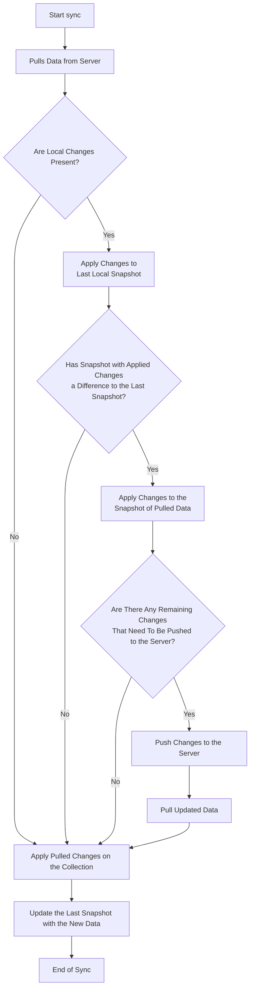

---
head:
- - link
  - rel: canonical
    href: https://signaldb.js.org/sync/
---
# Overview of Synchronization in SignalDB

## Introduction to Sync in SignalDB

SignalDB is designed to handle synchronization efficiently and flexibly, making it adaptable to various backend systems. At its core, synchronization in SignalDB revolves around ensuring that data across multiple collections remains consistent and up-to-date, whether you are working with a local-first approach or integrating with remote servers.

### High-Level Overview

In SignalDB, synchronization is managed by the `SyncManager` class, which is central to the framework's ability to maintain data consistency. The `SyncManager` is responsible for coordinating the synchronization process for multiple collections, pulling and pushing data as needed. This centralization provides several key benefits:

- **Flexibility**: SignalDB's sync mechanism is designed to work with any backend system, from REST APIs to GraphQL and beyond. This flexibility means you can integrate SignalDB with virtually any data source without worrying about compatibility issues.

- **Efficiency**: Instead of handling synchronization for each collection separately, the `SyncManager` allows you to manage sync operations for all collections from a single instance. This streamlined approach simplifies the development process, reducing the need for repetitive code and minimizing potential synchronization errors.

### Role of the SyncManager

The `SyncManager` class plays a pivotal role in SignalDB by:

- **Managing Multiple Collections**: A single `SyncManager` instance can oversee the sync operations for multiple collections simultaneously. This centralized management ensures that changes in one collection can be synchronized with others effectively and efficiently.

- **Improving Developer Experience**: By handling synchronization through one class instance, SignalDB enhances developer experience. You no longer need to call sync functions for each collection individually. Instead, you can manage all sync operations through the `SyncManager`, which takes care of coordinating and executing these tasks behind the scenes.

- **Conflict Resolution**: SignalDB provides built-in conflict resolution mechanisms to handle situations where data conflicts occur during synchronization. Conflict resolution ensures that the most recent changes are preserved, while maintaining data consistency across all collections.

- **Queueing Sync Operations**: The `SyncManager` queues sync operations to ensure that they are executed in the correct order. This is particularly important when dealing with interdependent collections or when sync operations have dependencies on each other.

- **Debouncing Pushes**: To optimize network usage and minimize unnecessary data transfers, the `SyncManager` debounces push operations. This means that multiple push operations for the same collection are merged into a single operation, reducing the number of network requests and improving performance.

This approach not only simplifies your codebase but also helps maintain consistency and reliability across your application's data.


## Local-First Synchronization vs. On-Demand Fetching

When it comes to data synchronization, SignalDB offers two primary strategies: local-first synchronization and on-demand fetching. Understanding the differences between these approaches can help you choose the best method for your application's needs.

### Local-First Synchronization

In a local-first synchronization approach, data changes are managed and stored locally on the client device. The local data is periodically synchronized with the server, either automatically or manually. This method provides several key benefits:

- **Performance**: Local-first syncing ensures that your application remains responsive, as data operations are performed locally before syncing with the server. This reduces the need for constant server interactions, leading to faster data retrieval and updates.

- **Offline Support**: With local-first synchronization, users can continue interacting with your application even when they are offline. Changes are queued locally and synchronized once connectivity is restored, ensuring a seamless experience regardless of network conditions.

- **Optimistic UI**: This approach allows for a smoother user experience by employing optimistic UI techniques. Users see immediate feedback on their actions (such as form submissions or data updates) while the sync process happens in the background. This eliminates the need for loading spinners or delays in user interactions.

### On-Demand Fetching

On-demand fetching involves retrieving data directly from the server whenever it is needed. This method can be more suitable in certain scenarios:

- **Up-to-Date Information**: For applications where having the most current data is essential, on-demand fetching guarantees that the latest information is always retrieved from the server. However it can lead to more network requests and potentially slower performance.

- **Resource Efficiency**: If the data changes infrequently or if the application primarily relies on the most up-to-date information, on-demand fetching can be more resource-efficient. It reduces the need for local storage and minimizes the complexity of handling local changes.

### Comparison

To help you better understand the differences, here's a comparison table highlighting the key aspects of each approach:

| Aspect                  | Local-First Synchronization       | On-Demand Fetching                |
|-------------------------|----------------------------------|----------------------------------|
| **Performance**         | High - operates locally, independent of server load and latency | Can be slower due to server request times |
| **Offline Support**     | Strong - allows for offline operations and synchronization later | Limited - relies on continuous connectivity |
| **User Experience**     | Smooth - uses optimistic UI for immediate feedback | May include delays or loading spinners during data fetch |
| **Real-Time Accuracy**  | May lag behind the server data if not synced frequently | Always retrieves the latest data from the server |
| **Resource Usage**      | Higher - requires local storage and management | Lower - no local storage needed |

In summary, local-first synchronization is ideal for enhancing performance and offline capabilities, while on-demand fetching is suited for applications that prioritize real-time data accuracy. SignalDB’s flexibility allows you to choose the approach that best fits your use case.


## Syncing with Any Backend

SignalDB is designed to offer versatile synchronization capabilities, making it compatible with a wide range of backend systems. Whether you're using REST APIs, GraphQL endpoints, or even custom protocols, SignalDB's modular architecture ensures smooth integration and synchronization.

### Backend-Agnostic Sync Mechanisms

SignalDB's synchronization mechanism is inherently backend-agnostic. This means it can connect and sync with virtually any type of backend system without requiring major modifications. The framework abstracts the specifics of the server interactions, allowing developers to focus on integrating their chosen backend without being tied to a particular technology.

### Abstracting Server Interaction

Central to this flexibility are the `pull` and `push` functions within the `SyncManager`. These functions act as intermediaries between your application and the backend, abstracting the details of data retrieval and submission. This design ensures that:

- **Pull Function**: Retrieves data from the server. You can define how data is fetched, whether it’s through a REST API call, a GraphQL query, or another method. This flexibility allows you to adapt to various server architectures with minimal effort.

- **Push Function**: Sends local changes to the server. Similar to the pull function, you can specify how changes are transmitted, ensuring compatibility with your backend's requirements. This includes sending data through HTTP methods, websockets, or custom protocols.

Additionally to this two functions, you can also register a function that can be called when the client receives live-updates from the server. With this concept, you can easily implement real-time updates in your application without the need to call the `pull` function everytime.

### Examples of Integration

Here’s how SignalDB can be integrated with different backend systems:

- **REST APIs**: SignalDB can interact with RESTful endpoints for both pulling and pushing data. For example, a `pull` function might fetch data from `/api/collections/todos`, while the `push` function sends updates to the same endpoint.

- **GraphQL**: For applications using GraphQL, SignalDB can perform queries and mutations. The `pull` function might execute a GraphQL query to retrieve collection data, and the `push` function could execute a mutation to submit changes.

- **Custom Protocols**: If you have a custom backend or protocol, you can implement the `pull` and `push` functions to accommodate these specifics. This ensures that SignalDB remains adaptable to unique or proprietary systems.

- **Live Updates**: SignalDB can also work with real-time updates through technologies like WebSockets or server-sent events. By integrating live update mechanisms, SignalDB can maintain real-time data synchronization across all clients.

In summary, SignalDB’s design ensures that you can synchronize data seamlessly with any backend system. Its modular approach, with abstracted `pull` and `push` functions, provides the flexibility to integrate with various technologies while maintaining efficient and reliable synchronization.

## Sync Flow & Conflict Resolution

SignalDB’s synchronization process is designed to efficiently handle the flow of data between the client and server, ensuring that local changes are correctly synchronized while managing conflicts in a straightforward manner.

To do that, SignalDB tracks all changes made locally to the data. This includes insertions, updates, and removals. These changes are logged and queued for synchronization with the server.

To handle conflicts, SignalDB uses a "replay" mechanism during synchronization. This involves:
- **Replaying Changes**: Local changes are applied to the latest data fetched from the server. This ensures that any conflicts are resolved based on the most recent data.
- **Handling Conflicts**: The "last change operation wins" strategy is employed, where changes are replayed on the latest data, and conflicts are resolved by applying the most recent operations.

### Sync Flow


SignalDB’s sync process consists of several key steps:

* **Client Pulls Data**: The client retrieves the latest data from the server. This is the initial step where the client gets up-to-date information from the backend. In a real-time scenario, this could also be triggered by a live-update from the server that notifies the client about changes.

* **Replay Changes**: Any local changes (such as inserts, updates, or removals) since last sync are applied on the new data to check which actual changes need to be pushed to the server. This step ensures that local modifications are applied to the updated data set, maintaining consistency and avoiding overwrites of remote changes.

* **Pushes Changes**: After applying local changes to the latest data, the client pushes these changes to the server. This ensures that the server receives and records the client’s updates.

* **Pulls Again for Verification**: Finally, the client performs another pull to verify that all changes have been correctly applied and synchronized with the server.

This following chart illustrates the sync flow in detail:



### Conflict Resolution

SignalDB uses a “last change operation wins” strategy to handle conflicts during synchronization. Here’s how it works:

- **Replay Mechanism**: When the client pulls the latest data, it replays all logged changes on top of this data. This ensures that any modifications made locally are applied to the most recent version of the data from the server.

- **Last Change Wins**: In cases where conflicts arise (e.g., when the same item has been modified both locally and on the server), the latest change operation takes precedence. The client's local changes are replayed on the most recent server data, ensuring that the latest state is reflected.

This strategy is suitable for many applications because it simplifies conflict resolution by ensuring that the most recent changes are applied. It also helps maintain a consistent state across clients by synchronizing modifications in a clear and predictable manner.

This chart illustrates the conflict resolution process:
````mermaid
sequenceDiagram
    Server->>+Client 1: pulls data
    Client 1-->>Client 1: logs operations A, B
    Server->>+Client 2: pulls data
    Client 2-->>Client 2: logs operations C, D
    Server->>Client 1: pulls latest data
    Client 1-->>Client 1: replays operations A, B on latest data
    Client 1->>-Server: pushes data
    Server->>Client 1: pulls latest data
    Server->>Client 2: pulls latest data
    Client 2-->>Client 2: replays operations C, D on latest data
    Client 2->>-Server: pushes data
    Server->>Client 2: pulls latest data
````
